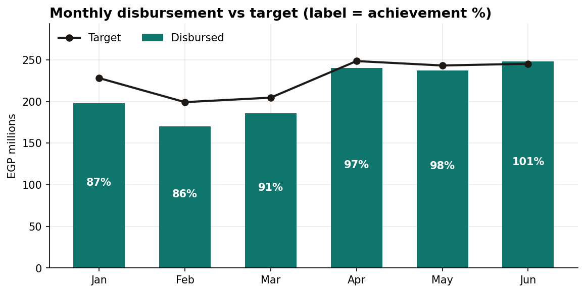
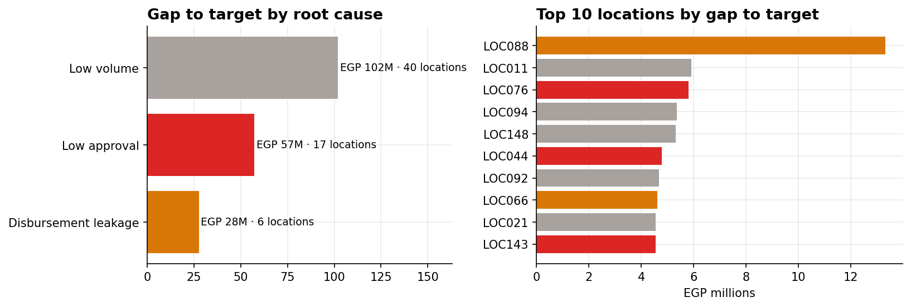
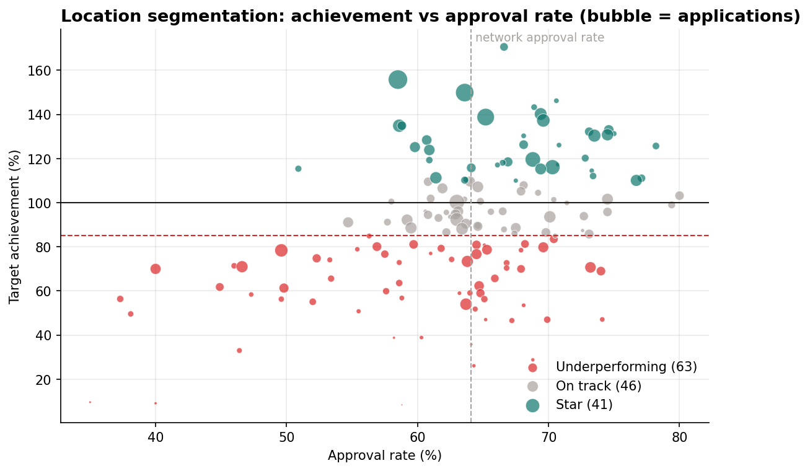
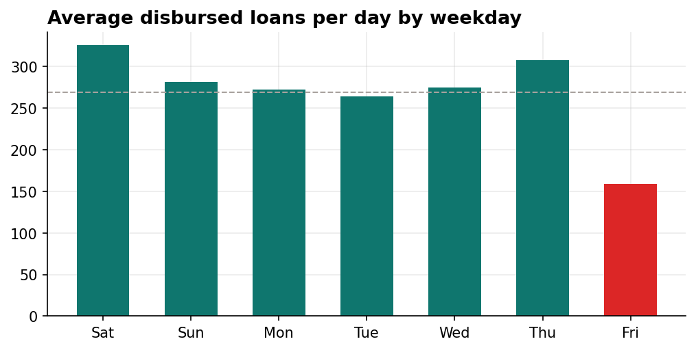
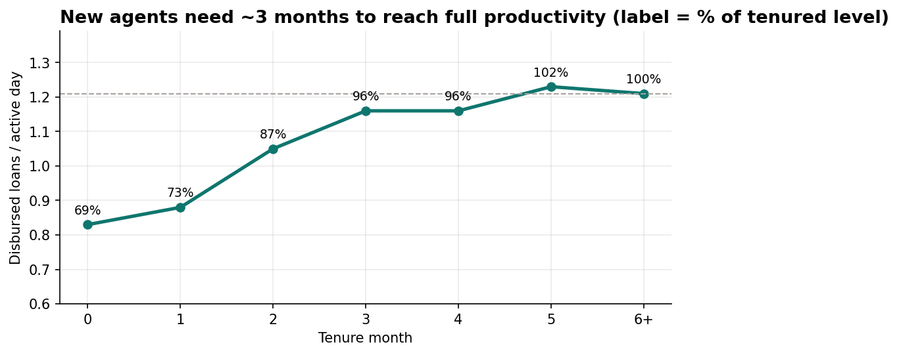
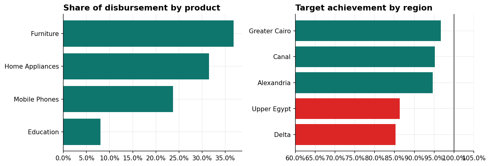

# Lending Sales Performance Analytics

**SQL · Python (pandas, matplotlib) · SQLite · KPI design · Segmentation**

End-to-end performance analysis of a consumer-lending sales network: **150 point-of-sale locations, 372 sales agents and ~84K loan applications over 6 months**.
The goal is to answer the questions a sales and performance management team asks every month:

- Are we hitting target, and where is the trend going?
- Which locations are underperforming, and **why**?
- How much revenue is at stake, and what should we do about it?

> ⚠️ **All data is synthetic.** This project is inspired by my work in lending performance analytics, but every table was generated from scratch with [`src/generate_data.py`](src/generate_data.py). No real company, customer or employee data is used.

---

## Key results

| Metric | Value |
|---|---|
| Applications | 83,892 |
| Approval rate | 64.1% |
| Approved → disbursed | 90.6% |
| Disbursed | EGP 1,279M |
| H1 target achievement | **93.4%** |
| Underperforming locations (< 85% of target) | **63 of 150** |
| Gap to target in underperforming locations | **EGP 187M** |



### Where the gap comes from

Every underperforming location gets a **root-cause flag** by comparing its funnel with the network benchmark:

| Root cause | Rule | Locations | Gap |
|---|---|---|---|
| Low volume | funnel healthy, not enough applications | 40 | EGP 102M |
| Low approval | approval rate 10+ pts below network | 17 | EGP 57M |
| Disbursement leakage | approved → disbursed 10+ pts below network | 6 | EGP 28M |



### Location segmentation



### Other insights

- **Fridays are ~45% weaker** than other days (159 vs 287 disbursed loans per day).
- **New agents start at ~69% of tenured productivity** and need about 3 months to reach full speed.
- **Furniture** is the largest product by value (37% of disbursement) but has the lowest approval rate (59%).
- **Delta (85%)** and **Upper Egypt (86%)** trail Greater Cairo (97%) on achievement.

| | |
|---|---|
|  |  |



## Recommendations

1. **Low-volume locations:** drive footfall with in-store partner promotions and match staffing to Thursday/Saturday peaks.
2. **Low-approval locations:** agent pre-screening checklist and coaching on eligibility rules.
3. **Leakage locations:** follow up approved-not-disbursed customers within 24–48 hours. Matching network conversion alone recovers **~EGP 11M**.
4. **Fridays:** targeted Friday incentives or shift changes.
5. **New agents:** structured 90-day onboarding with ramped targets.
6. **Targets:** recalibrate using location potential, since some locations sit far above 130% or below 50%.

---

## Project structure

```
lending-sales-performance-analytics/
├── data/                  # synthetic CSVs + SQLite database (lending.db)
├── images/                # charts exported by the notebook
├── notebooks/
│   └── lending_performance_analysis.ipynb   # full analysis, story and recommendations
├── sql/
│   ├── 01_kpi_overview.sql                  # network funnel KPIs
│   ├── 02_monthly_trend.sql                 # trend, achievement, MoM growth (LAG)
│   ├── 03_location_scorecard.sql            # per-location scorecard + RANK()
│   ├── 04_product_region_performance.sql    # product mix (window share) & region vs target
│   ├── 05_agent_ramp_up.sql                 # productivity by agent tenure
│   └── 06_underperformers_revenue_gap.sql   # root-cause flag & gap to target
├── src/
│   └── generate_data.py   # builds the synthetic dataset
└── requirements.txt
```

## Data model

| Table | Rows | Description |
|---|---|---|
| `applications` | 83,892 | one row per loan application: date, agent, location, product, requested amount, decision, disbursed flag & amount |
| `targets` | 900 | monthly disbursement target per location |
| `agents` | 372 | agent, location, hire date |
| `locations` | 150 | region, location type, opening date |
| `products` | 4 | Mobile Phones, Home Appliances, Furniture, Education |

The generator plants realistic patterns on purpose (low-approval locations, disbursement leakage, new-agent ramp-up, weekday and monthly seasonality) so the analysis has real signals to uncover.

## How to run

```bash
pip install -r requirements.txt
python src/generate_data.py          # optional: data is already included
jupyter notebook notebooks/lending_performance_analysis.ipynb
```

The SQL files use SQLite syntax and can be run directly on `data/lending.db` (e.g. with DB Browser for SQLite or DBeaver).

---

**Lama Osama** · Data Analyst · [LinkedIn](https://www.linkedin.com/in/lamaosama1997/) · [Portfolio](https://lamaosama.github.io)
